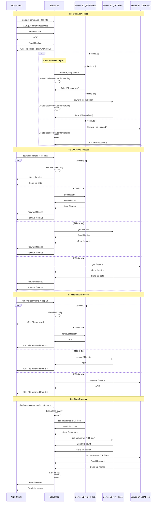

process flow diagram : 

```mermaid
sequenceDiagram
    participant Client as W25 Client
    participant S1 as Server S1
    participant S2 as Server S2 (PDF Files)
    participant S3 as Server S3 (TXT Files)
    participant S4 as Server S4 (ZIP Files)
    
    Note over Client,S4: File Upload Process
    
    Client->>S1: uploadf command + file info
    S1->>Client: ACK (Command received)
    Client->>S1: Send file size
    S1->>Client: ACK
    Client->>S1: Send file data
    S1->>Client: OK: File stored [locally/remotely]
    
    alt If file is .c
        Note over S1: Store locally in /tmp/S1/
    else If file is .pdf
        S1->>S2: forward_file (uploadf)
        S1->>S1: Delete local copy after forwarding
        S2->>S1: ACK (File received)
    else If file is .txt
        S1->>S3: forward_file (uploadf)
        S1->>S1: Delete local copy after forwarding
        S3->>S1: ACK (File received)
    else If file is .zip
        S1->>S4: forward_file (uploadf)
        S1->>S1: Delete local copy after forwarding
        S4->>S1: ACK (File received)
    end
    
    Note over Client,S4: File Download Process
    
    Client->>S1: downlf command + filepath
    
    alt If file is .c
        S1->>S1: Retrieve file locally
        S1->>Client: Send file size
        S1->>Client: Send file data
    else If file is .pdf
        S1->>S2: getf filepath
        S2->>S1: Send file size
        S2->>S1: Send file data
        S1->>Client: Forward file size
        S1->>Client: Forward file data
    else If file is .txt
        S1->>S3: getf filepath
        S3->>S1: Send file size
        S3->>S1: Send file data
        S1->>Client: Forward file size
        S1->>Client: Forward file data
    else If file is .zip
        S1->>S4: getf filepath
        S4->>S1: Send file size
        S4->>S1: Send file data
        S1->>Client: Forward file size
        S1->>Client: Forward file data
    end
    
    Note over Client,S4: File Removal Process
    
    Client->>S1: removef command + filepath
    
    alt If file is .c
        S1->>S1: Delete file locally
        S1->>Client: OK: File removed
    else If file is .pdf
        S1->>S2: removef filepath
        S2->>S1: ACK
        S1->>Client: OK: File removed from S2
    else If file is .txt
        S1->>S3: removef filepath
        S3->>S1: ACK
        S1->>Client: OK: File removed from S3
    else If file is .zip
        S1->>S4: removef filepath
        S4->>S1: ACK
        S1->>Client: OK: File removed from S4
    end
    
    Note over Client,S4: List Files Process
    
    Client->>S1: dispfnames command + pathname
    S1->>S1: List .c files locally
    S1->>S2: listf pathname (PDF files)
    S2->>S1: Send file count
    S2->>S1: Send file names
    S1->>S3: listf pathname (TXT files)
    S3->>S1: Send file count
    S3->>S1: Send file names
    S1->>S4: listf pathname (ZIP files)
    S4->>S1: Send file count
    S4->>S1: Send file names
    S1->>S1: Sort file list
    S1->>Client: Send file count
    S1->>Client: Send file names
```
